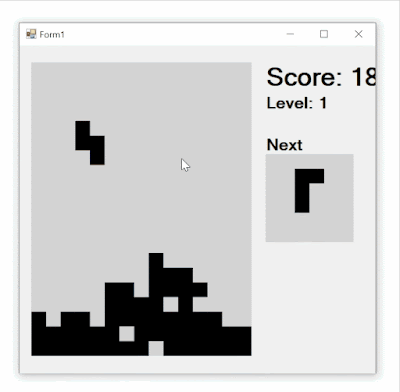

# **Projet Tetris**

---

### Membres du groupe:

 Peyrataud Enzo | Bourin Léo 

  

---

  

## Présentation du projet

  

- Le projet consiste à créer un jeu Tetris en C# avec l'outil Visual Studio .

  

### Procédure d'installation de notre projet en local

  

### I) Prérequis de base

- Avoir Visual Studio pour pouvoir lancer le projet .

### II) Exemples d'utilisation

On retrouve sur notre jeu plusieurs éléments tels que :

- Le jeu du côté gauche .
- La progression du joueur / Le bloc suivant qui sera disponible à droite.

On gagne un point lorsque le joueur rempli une rangée complète.

Le niveau commence à **0**. Tout les **10 points**, le niveau augmente de **1**. 

Plus le niveau est élevé, plus la difficulté est augmenté.  

Lorsque le joueur est arrivé à la dernière rangée, la partie est terminée.

